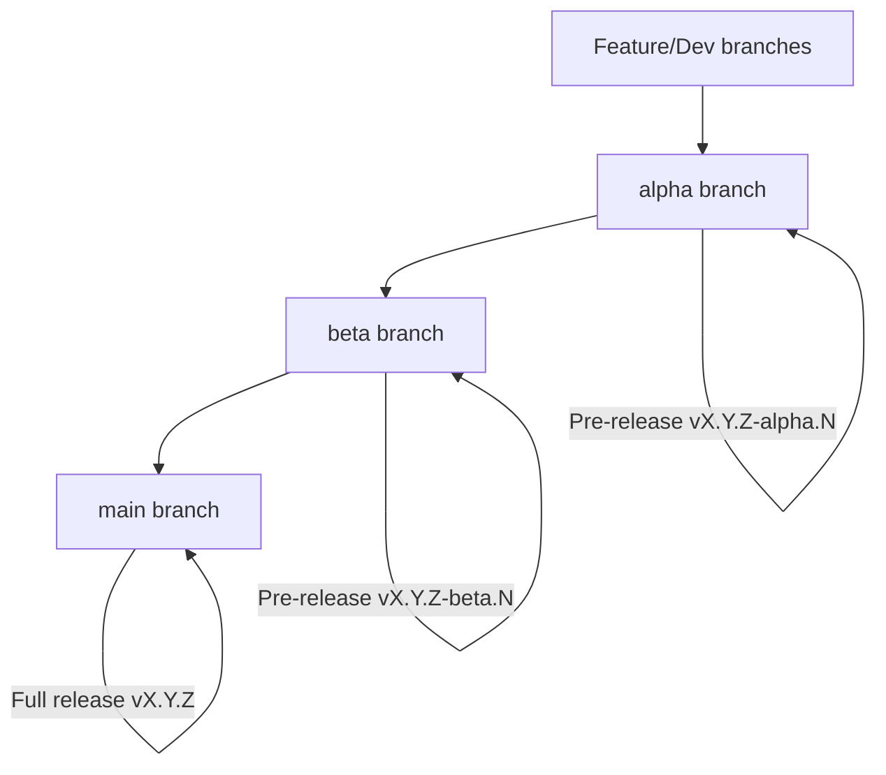
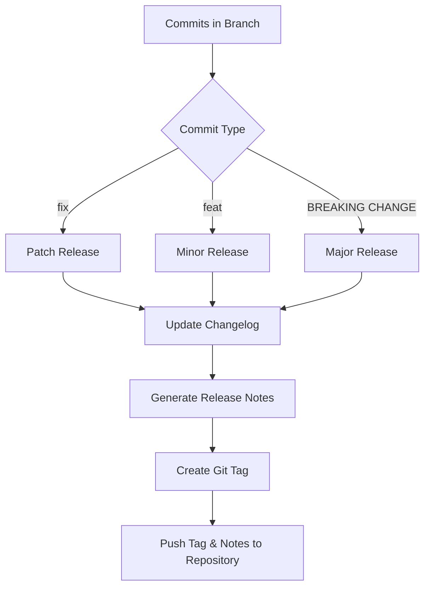

# PSSemanticRelease (Powershell Semantic Release)

Automated semantic versioning and release for PowerShell modules, inspired by the [semantic-release](https://github.com/semantic-release/semantic-release) project.

[](https://www.powershellgallery.com/packages/PSSemanticRelease)

> **Warning:** This module is still a work in progress. APIs and features may change.

---

## Features

* Automated versioning using commit messages.
* Generate changelogs and release notes automatically.
* Git tagging and optional GitHub/GitLab integration.
* Dry-run mode for safe testing.
* Extensible via plugins: `CommitAnalyzer`, `ReleaseNotesGenerator`, `Changelog`, `Git`, `Exec`, `GitHub`.

---

## Installation

```powershell
Install-Module PSSemanticRelease -Scope CurrentUser
```

> Note: Use `-AllowPrerelease` to get the latest prerelease builds.

Or clone from GitHub and import manually:

```powershell
Import-Module ./PSSemanticRelease -Force
```

---

## Default Configuration

Located at `PSSemanticRelease/config/semantic-release.json`:

```json
{
  "branches": [
    "main",
    { "name": "beta", "prerelease": "beta" },
    { "name": "alpha", "prerelease": "alpha" }
  ],
  "unifyTag": false,
  "plugins": [
    [
      "CommitAnalyzer",
      {
        "releaseRules": [
          { "type": "fix", "release": "patch", "section": "Bug Fixes" },
          { "type": "feat", "release": "minor", "section": "Features" }
        ]
      }
    ],
    [
      "ReleaseNotesGenerator",
      { 
        "commitsSort": ["scope", "subject"]
      }
    ],
    [
      "Changelog",
      { 
        "file": "CHANGELOG.md", "title": "" 
      }
    ]
  ]
}
```

### Sample Repository Configuration

```json
{
  "plugins": [
    "CommitAnalyzer",
    "ReleaseNotesGenerator",
    "Changelog",
    "Git",
    [
      "Exec",
      {
        "preparePsScript": "create-dist.ps1 -NoProfile -ExecutionPolicy Bypass {DryRun} {NextRelease.Version} {NextRelease.Channel}",
        "publishPsScript": "publish-dist.ps1 -NoProfile -ExecutionPolicy Bypass {DryRun}"
      }
    ],
    "GitHub"
  ],
  "unifyTag": true
}
```

---

## Usage

Run a dry release:

```powershell
Invoke-SemanticRelease -DryRun
```

Run a real release (requires CI environment or Git credentials):

```powershell
Invoke-SemanticRelease
```

---

## Recommended Branch Workflow

```
          +-------------------+
          |       main        |
          +-------------------+
                   |
                   | Full release (vX.Y.Z)
                   v
          +-------------------+
          |       beta        |
          +-------------------+
                   |
                   | Pre-release (vX.Y.Z-beta.N)
                   v
          +-------------------+
          |       alpha       |
          +-------------------+
                   |
                   | Pre-release (vX.Y.Z-alpha.N)
                   v
               Feature/Dev branches
```

Or with Mermaid diagram (renders in GitHub):



---

## Release Flow Example

| Commit Type       | Release Type | Version Bump  | Tag Example |
| ----------------- | ------------ | ------------- | ----------- |
| `fix: bug fix`    | patch        | 1.6.0 → 1.6.1 | v1.6.1      |
| `feat: new feat`  | minor        | 1.6.1 → 1.7.0 | v1.7.0      |
| `feat!: CHANGE`   | major        | 1.7.0 → 2.0.0 | v2.0.0      |

#### Semantic Release Flow (Mermaid Diagram)



---

## Notes

* Semantic versioning is based on commit messages (`fix`, `feat`).
* Plugins are loaded dynamically, allowing easy extension for custom steps.
* Dry-run mode is highly recommended for testing before real releases.
* Inspired by the [semantic-release](https://github.com/semantic-release/semantic-release) project.